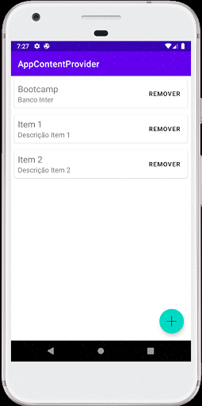
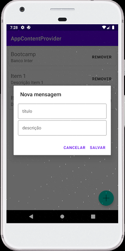

# AppContentProvider

App Android que cria itens e os disponibiliza para outro app através de Content Provider. 

Obs: Necessário acessar o projeto [AppContentProviderClient](https://github.com/guilhermereisdev/AppContentProviderClient) para visualizar os itens disponibilizados.

#### Screenshots

